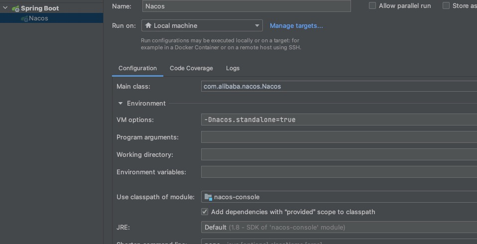

### Nacos

#### Nacos 源码编译
1. 登录github
2. 搜索nacos
3. fork
4. git clone https://github.com/liufeng82012016/nacos.git
5. git checkout 2.2.0
6. git branch liufeng 2.2.0
7. 将所有模块都编译一遍，防止依赖找不到
8. 选中 com.alibaba.nacos.Nacos.main() 
   1. UnknownHostException:jmenv.tbsite.net
   2. GitHub issue：https://github.com/alibaba/nacos/issues/2902
   3. 编辑启动参数，增加 -Dnacos.standalone=true
   4. 
   5. 再次启动，启动成功，访问 localhost:8848/nacos 成功

### 其他
1. Mac释放应用内存
   1. sudo su
   2. 输入密码
   3. cd /Applications/Utilities/
   4. purge